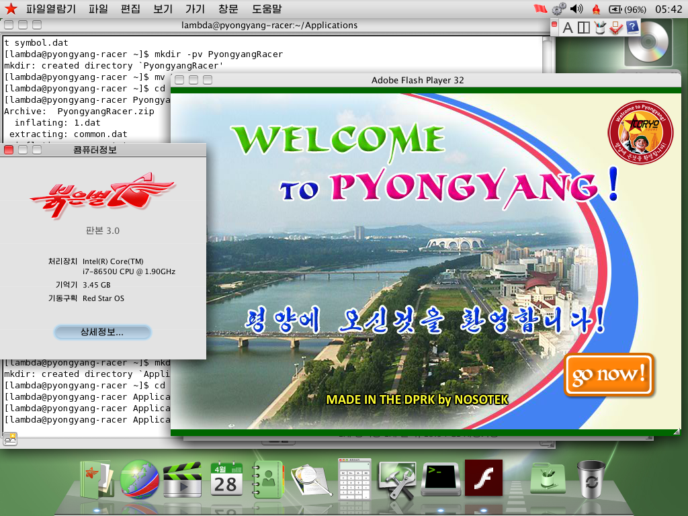

# A Strange Tour of North Korea with Red Star OS
My slides, presentation, and other bits from my talk for JawnCon 0x1

## What's This All About?
I was invitied to give my talk about Red Star OS that I gave for DC212
back in April 2024 at JawnCon 0x1, which I accepted as this would be my
first time speaking at a conf, and I thought it would be a fun subject
to share with everyone there!

## What's in the repo?

The slides are in the slides/ folder, in .png and .pdf formats.

Included is a .pcap file I captured using Wireshark in my April talk,
which shows a few network oddities and behaviors I pointed out in my talk.
Browser activity will show pings to a North Korean IP address mixed
in with the GET requests.

Enjoy and share the knowledge, and HACK THE PLANET!